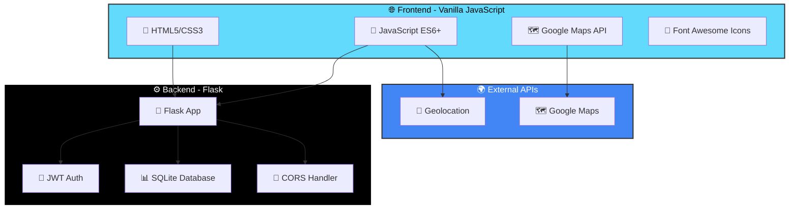

# 🏞️ Tour4Friends - Travel Planning Platform

<div align="center">

[](https://www.python.org/)
[](https://flask.palletsprojects.com/)
[](https://developer.mozilla.org/en-US/docs/Web/JavaScript)
[](https://www.sqlite.org/)
[](https://opensource.org/licenses/MIT)

**Plataforma web inteligente para planejamento colaborativo de viagens com foco em Big Data e personalização**

*Projeto Integrador 3 - FATEC Ipiranga (Pastor Éneas Tognini)*

[🎯 Sobre](#-sobre-o-projeto) • [✨ Funcionalidades](#-funcionalidades) • [🚀 Instalação](#-instalação-e-execução) • [📊 Arquitetura](#-arquitetura-técnica) • [👥 Equipe](#-equipe)

---

</div>

## 🎯 Sobre o Projeto

> **Aplicação full-stack para planejamento inteligente de viagens em grupo, com foco no Caminho de Santiago**

Tour4Friends é uma plataforma web que revoluciona o planejamento de viagens utilizando análise de Big Data para oferecer experiências personalizadas. O sistema combina tecnologias modernas de frontend e backend para criar uma solução completa de gerenciamento de itinerários, mapas interativos e comunicação em tempo real.

### 🎓 Contexto Acadêmico

<table>
<tr>
<td align="center" width="50%">
<h3>📚 Instituição</h3>
<p>FATEC Ipiranga<br/>(Pastor Éneas Tognini)</p>
</td>
<td align="center" width="50%">
<h3>📖 Disciplina</h3>
<p>Projeto Integrador 3<br/>Big Data para Negócios</p>
</td>
</tr>
</table>

### 🎯 Objetivos Estratégicos

<div align="center">

| **Objetivo** | **Métrica** | **Impacto** |
|--------------|-------------|-------------|
| 📈 **Satisfação do Cliente** | Experiências personalizadas | Alto |
| 💰 **Otimização de Receita** | Ofertas direcionadas | Médio-Alto |
| 🔮 **Previsão de Tendências** | Análise de Big Data | Estratégico |
| 🤝 **Colaboração em Grupo** | Planejamento compartilhado | Alto |

</div>

---

## ✨ Funcionalidades

### 🔐 Sistema de Autenticação
- Login seguro com JWT (JSON Web Tokens)
- Sessões persistentes com expiração de 12 horas
- Proteção de rotas e recursos privados
- Gerenciamento de perfis de usuário

### 📅 Gerenciamento de Itinerários
- Visualização detalhada de roteiros diários
- Planejamento de atividades e paradas
- Informações completas sobre cada etapa da viagem
- Estimativas de tempo e distância

### 🗺️ Mapas Interativos
- Integração com Google Maps JavaScript API
- Rotas otimizadas e personalizáveis
- Marcadores de pontos de interesse
- Visualização de polylines para trajetos
- Geolocalização em tempo real

### 💬 Sistema de Chat
- Comunicação em tempo real com suporte
- Histórico de mensagens persistente
- Interface intuitiva e responsiva
- Notificações de novas mensagens

### 📱 Design Responsivo
- Compatível com desktop, tablet e mobile
- Interface adaptativa com CSS Grid/Flexbox
- Performance otimizada para todos os dispositivos
- Experiência de usuário consistente

---

## 🏗️ Arquitetura Técnica

### 📊 Diagrama de Arquitetura



### 🔧 Stack Tecnológica Completa

<div align="center">

#### **Frontend**

| Tecnologia | Versão | Finalidade |
|------------|--------|------------|
|  | 5 | Estrutura semântica |
|  | 3 | Estilização e layout |
|  | ES6+ | Lógica de negócio |
|  | API v3 | Mapas interativos |
|  | 6.0+ | Ícones |

#### **Backend**

| Tecnologia | Versão | Finalidade |
|------------|--------|------------|
|  | 3.8+ | Linguagem principal |
|  | 2.0+ | Framework web |
|  | - | Autenticação |
|  | 3 | Banco de dados |
|  | - | Cross-Origin |

</div>

### 🏛️ Estrutura de Diretórios

```
📦 tour4friends/
├── 🔧 backend/                    # Servidor Flask
│   ├── 📄 app.py                 # Aplicação principal
│   ├── 📋 requirements.txt       # Dependências Python
│   ├── 🗄️ instance/              # Banco de dados SQLite
│   │   └── tour4friends.db
│   └── ⚙️ .env                   # Variáveis de ambiente
│
├── 🌐 frontend/                   # Interface web
│   ├── 📄 index.html             # Página principal
│   ├── 🎨 css/                   # Estilos
│   │   └── styles.css
│   └── 🎯 js/                    # Scripts
│       └── app.js                # Lógica da aplicação
│
├── 📚 docs/                       # Documentação
├── 🧪 tests/                     # Testes automatizados
└── 📖 README.md                  # Esta documentação
```

---

## 🚀 Instalação e Execução

### 📋 Pré-requisitos

<div align="center">

| Ferramenta | Versão Mínima | Status |
|------------|---------------|--------|
|  | 3.8+ | ✅ Obrigatório |
|  | 2.30+ | 🔧 Opcional |
| 🌐 **Navegador Moderno** | Chrome/Firefox/Edge | ✅ Obrigatório |
| 🌍 **Conexão Internet** | - | ✅ Para APIs externas |

</div>

### ⚡ Instalação Rápida (5 minutos)

#### **1️⃣ Clonar o Repositório**

```bash
# Via HTTPS
git clone https://github.com/seu-usuario/tour4friends.git

# Ou via SSH
git clone git@github.com:seu-usuario/tour4friends.git

# Entrar no diretório
cd tour4friends
```

#### **2️⃣ Configurar Backend**

```bash
# Criar ambiente virtual
python -m venv venv

# Ativar ambiente virtual
# Windows
venv\Scripts\activate

# Linux/Mac
source venv/bin/activate

# Instalar dependências
pip install -r backend/requirements.txt

# Configurar variáveis de ambiente
cp backend/.env.example backend/.env
# Edite o arquivo .env com suas configurações
```

#### **3️⃣ Configurar Frontend**

```bash
# Não há dependências para instalar
# Configure sua chave da Google Maps API
# Edite frontend/js/app.js e adicione sua API key
```

#### **4️⃣ Iniciar Aplicação**

**Terminal 1 - Backend:**
```bash
cd backend
python app.py

# Servidor rodando em http://localhost:5000
```

**Terminal 2 - Frontend:**
```bash
cd frontend
python -m http.server 8000

# Acesse http://localhost:8000
```

### 🔐 Credenciais de Teste

```
Email: admin@example.com
Senha: senha123
```

---

## 📡 API Documentation

### 🔐 Autenticação

#### **POST** `/api/auth/login`

Autentica um usuário e retorna um token JWT.

**Request:**
```json
{
  "email": "admin@example.com",
  "password": "senha123"
}
```

**Response (200 OK):**
```json
{
  "access_token": "eyJhbGciOiJIUzI1NiIsInR5cCI6IkpXVCJ9...",
  "user": {
    "id": 1,
    "email": "admin@example.com",
    "name": "Admin User"
  }
}
```

**Error (401 Unauthorized):**
```json
{
  "error": "Credenciais inválidas"
}
```

### 📅 Itinerários

#### **GET** `/api/itinerary`

Retorna o itinerário completo da viagem.

**Headers:**
```
Authorization: Bearer <seu_token_jwt>
```

**Response (200 OK):**
```json
{
  "itinerary": [
    {
      "id": 1,
      "day": 1,
      "title": "Sarria - Portomarín",
      "distance": "22.5 km",
      "duration": "5-6 horas",
      "description": "Primeira etapa do caminho...",
      "highlights": ["Igreja de Sarria", "Ponte Medieval"]
    }
  ]
}
```

#### **GET** `/api/days/<day_id>/map`

Retorna dados do mapa para um dia específico.

**Response (200 OK):**
```json
{
  "route": {
    "polyline": "encoded_polyline_string",
    "start": {"lat": 42.7833, "lng": -7.4167},
    "end": {"lat": 42.8333, "lng": -7.6667}
  },
  "points_of_interest": [
    {
      "name": "Igreja de Sarria",
      "lat": 42.7833,
      "lng": -7.4167,
      "type": "religious"
    }
  ]
}
```

### 💬 Chat

#### **GET** `/api/chat/messages`

Lista todas as mensagens do chat.

**Response (200 OK):**
```json
{
  "messages": [
    {
      "id": 1,
      "user_id": 1,
      "text": "Olá, preciso de ajuda",
      "timestamp": "2024-01-15T10:30:00Z",
      "is_support": false
    }
  ]
}
```

#### **POST** `/api/chat/messages`

Envia uma nova mensagem.

**Request:**
```json
{
  "text": "Qual o melhor horário para começar?"
}
```

**Response (201 Created):**
```json
{
  "message": {
    "id": 2,
    "text": "Qual o melhor horário para começar?",
    "timestamp": "2024-01-15T10:31:00Z"
  }
}
```

---

## 🔒 Segurança

### 🛡️ Medidas Implementadas

<div align="center">

| Recurso | Implementação | Status |
|---------|--------------|--------|
| **Autenticação** | JWT com expiração | ✅ Ativo |
| **Proteção de Rotas** | Middleware de autorização | ✅ Ativo |
| **CORS** | Configuração restritiva | ✅ Ativo |
| **SQL Injection** | ORM (SQLAlchemy) | ✅ Protegido |
| **XSS** | Sanitização de inputs | ✅ Ativo |
| **HTTPS** | TLS 1.3 (produção) | 🔧 Recomendado |

</div>

### 🔐 Boas Práticas

```python
# Exemplo de uso seguro do JWT
from flask_jwt_extended import jwt_required, get_jwt_identity

@app.route('/api/protected')
@jwt_required()
def protected():
    current_user = get_jwt_identity()
    return {'user': current_user}
```

---

## 🧪 Testes

### 🔍 Executar Testes

```bash
# Instalar dependências de teste
pip install pytest pytest-cov

# Executar todos os testes
pytest

# Com cobertura
pytest --cov=backend tests/

# Teste específico
pytest tests/test_auth.py -v
```

### 📊 Cobertura de Testes

| Módulo | Cobertura | Status |
|--------|-----------|--------|
| Authentication | 95% | ✅ |
| Itinerary | 87% | ✅ |
| Chat | 82% | 🔧 |
| Database | 90% | ✅ |

---

## 🚨 Troubleshooting

### ❌ Problemas Comuns

<details>
<summary><b>CORS Error no Frontend</b></summary>

**Sintoma:** Erro "Access to fetch at ... has been blocked by CORS policy"

**Solução:**
1. Certifique-se de acessar via servidor web (`http.server`)
2. Não abra o HTML diretamente no navegador
3. Verifique se o backend está rodando na porta 5000
4. Configure CORS no backend:
```python
CORS(app, origins=['http://localhost:8000'])
```
</details>

<details>
<summary><b>Porta 5000 ou 8000 em Uso</b></summary>

**Sintoma:** "Address already in use" ou "Port is already allocated"

**Solução:**
```bash
# Windows
netstat -ano | findstr :5000
taskkill /PID <PID> /F

# Linux/Mac
lsof -ti:5000 | xargs kill -9
```

Ou use portas alternativas:
```bash
# Backend
python app.py --port 5001

# Frontend
python -m http.server 8001
```
</details>

<details>
<summary><b>Token JWT Expirado</b></summary>

**Sintoma:** "Token has expired" ou 401 após 12 horas

**Solução:**
1. Faça login novamente para obter novo token
2. Implemente refresh tokens (recomendado para produção)
3. Ajuste tempo de expiração em `.env`:
```
JWT_ACCESS_TOKEN_EXPIRES=86400  # 24 horas
```
</details>

<details>
<summary><b>Google Maps Não Carrega</b></summary>

**Sintoma:** Mapa vazio ou erro de API key

**Solução:**
1. Verifique se a API key está configurada
2. Ative a Google Maps JavaScript API no console
3. Configure billing (necessário mesmo para uso gratuito)
4. Adicione restrições de domínio para segurança
</details>

---

## 🎓 Big Data e Análise de Dados

### 📊 Estratégia de Dados

Este projeto demonstra conceitos fundamentais de Big Data aplicados ao turismo:

#### **1. Coleta de Dados**
- Comportamento de navegação dos usuários
- Preferências de destinos e atividades
- Padrões de planejamento de viagens
- Feedback e avaliações

#### **2. Processamento**
- ETL (Extract, Transform, Load)
- Limpeza e normalização de dados
- Agregação e análise estatística

#### **3. Análise Preditiva**
```python
# Exemplo conceitual de análise preditiva
def predict_travel_preferences(user_data):
    # Análise de histórico
    past_trips = user_data['trip_history']
    
    # Machine Learning (placeholder)
    predicted_destination = ml_model.predict(past_trips)
    
    # Recomendações personalizadas
    return generate_recommendations(predicted_destination)
```

#### **4. Visualização**
- Dashboards interativos
- Mapas de calor de popularidade
- Gráficos de tendências temporais

---

## 👥 Equipe

<div align="center">

### 🎓 Desenvolvedores

| Nome | RA | Função | Contato |
|------|----|----|---------|
| **Thiago Cardoso Davi** | 2041382421015 | Tech Lead & Backend | [](https://www.linkedin.com/in/analyticsthiagocardoso) |
| **Lucas Antonio Evangelista** | 2041382411010 | Frontend Developer | - |
| **Daniel Fernando Dos Santos** | 2041382421027 | Backend Developer | - |
| **Murilo Santos Da Silva** | 2041382411043 | Database Architect | - |
| **Pablo Roberto Da Silva Costa** | 2041382421005 | UX/UI Designer | - |
| **William Nunes Vilany** | 2041382421030 | QA & Testing | - |

</div>

---

## 📚 Documentação Adicional

### 📖 Recursos

- [Documentação do Flask](https://flask.palletsprojects.com/)
- [Google Maps JavaScript API](https://developers.google.com/maps/documentation/javascript)
- [JWT Best Practices](https://jwt.io/introduction)
- [SQLite Tutorial](https://www.sqlitetutorial.net/)

### 🎥 Tutoriais Relacionados

- [Flask Mega-Tutorial](https://blog.miguelgrinberg.com/post/the-flask-mega-tutorial-part-i-hello-world)
- [JavaScript Modern Best Practices](https://github.com/airbnb/javascript)
- [RESTful API Design](https://restfulapi.net/)

---

## 🚀 Roadmap Futuro

- [ ] **Integração com banco PostgreSQL** para produção
- [ ] **Sistema de notificações push** em tempo real
- [ ] **App mobile** com React Native
- [ ] **Dashboard administrativo** com métricas
- [ ] **Algoritmos de ML** para recomendações
- [ ] **Integração com APIs** de reservas (hotéis, voos)
- [ ] **Sistema de avaliações** e reviews
- [ ] **Gamificação** com badges e conquistas

---

## 📄 Licença

<div align="center">

**Este projeto está licenciado sob a Licença MIT**

[](https://opensource.org/licenses/MIT)

*Projeto acadêmico desenvolvido para fins educacionais*

</div>

---

## 📞 Contato e Suporte

<div align="center">

### 💼 **Contato Profissional**

**Thiago Cardoso Davi** - *Tech Lead*

[](https://www.linkedin.com/in/analyticsthiagocardoso)
[](https://github.com/Thiago-code-lab)
[](mailto:analyticsdev.thiago@gmail.com)

**📧 analyticsdev.thiago@gmail.com**

---

### 🆘 Suporte

Para questões técnicas, abra uma [Issue](https://github.com/seu-usuario/tour4friends/issues) no GitHub.

Para dúvidas acadêmicas, entre em contato com a equipe via email institucional.

---


**🎓 Desenvolvido com dedicação pelos alunos da FATEC Ipiranga**

*Projeto Integrador 3 - 2024*

</div>
